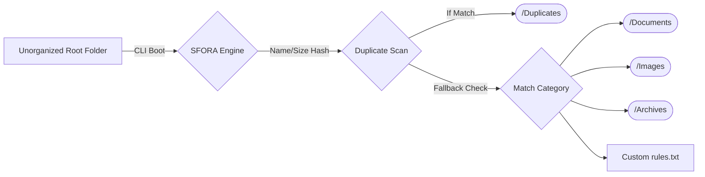

<div align="center">
  
  
  # 🚀 SFORA 
  **Smart File Organizer with Rule-Based Automation** 
  
  [](https://java.com/)
  [](#)
  [](#)
  [](#)

  <p align="center">
    <strong>SFORA</strong> is a brutally light, extremely fast directory orchestrator built completely in pure Java. Quit struggling with massive, unstructured <code>Downloads/</code> folders. SFORA cleans, audits, and structures messy files in milliseconds.
  </p>
</div>

---

<details open>
  <summary><b>📑 Table of Contents</b></summary>
  <br/>
  
  1. [✨ The Problem & Solution](#-the-problem--solution)
  2. [🔥 Core Architecture Diagram](#-core-architecture-diagram)
  3. [🛠️ Technical Features](#%EF%B8%8F-technical-features)
  4. [💻 Seamless Execution](#-seamless-execution)
  5. [⚙️ Custom Rules Engine](#%EF%B8%8F-custom-rules-engine)
  6. [🔄 Action Log & Revert](#-action-log--revert)
</details>

---

## ✨ The Problem & Solution

Standard file management is **manual, tedious, and highly error-prone**. Browsing through thousands of heterogeneous documents, installers, and archives wastes countless hours. 

**The Solution:** SFORA leverages an autonomous `java.io` decision-tree engine to isolate files, verify configurations, duplicate-check using string arrays, and safely migrate massive data sets accurately—all running head-less via a highly intuitive CLI loop.

---

## 🔥 Core Architecture Diagram

SFORA executes atomic operations routing files dynamically prior to validating local duplicate collisions.



---

## 🛠️ Technical Features

| Feature Module | Technical Overview |
|:---|:---|
| 🗂️ **Taxonomy Shunting** | Evaluates object extensions dynamically (`.png` --> `/Images`, `.zip` --> `/Archives`, `.docx` --> `/Documents`). |
| 🛡️ **$O(N)$ Dupe Finder** | Avoids expensive cryptographic tracking by natively executing parallel `FileName + ByteSize` pairing to intercept deep storage duplications. |
| 🔮 **Dry-Run Environment** | Initiates strict read-only execution pipelines, aggressively scanning target folders and compiling simulated statistics (including explicitly flagging `>100MB` files) prior to committing disk I/O. |
| ⏪ **Persistent Rollback** | Caches atomic disk relocations to a universal `action_log.txt` matrix. This physical Memento system explicitly enables users to execute absolute "Undo" protocols flawlessly, even upon terminating the application. |
| 🧹 **Space-Saver Extraction** | Allows dynamic runtime configurations filtering massive storage-hog files (e.g. ISOs, VM files) utilizing strict `long megabytes` thresholds, isolating them securely. |

---

## 💻 Seamless Execution

SFORA inherently enforces **Zero Dependency Architecture**. No Maven, no Gradle, no frameworks. It behaves identically across Unix, Linux, and Windows ecosystems.

### 1. Source Compilation
Bootstrap from your root folder.
```bash
> mkdir bin
> javac -d bin src/*.java
```

### 2. Boot Application
Initialize the terminal sequence.
```bash
> java -cp bin Main
```

---

## ⚙️ Custom Rules Engine

Don't want generic file-type sorting? Explicitly define absolute routing behaviors universally in `rules.txt`.

```text
# CONFIGURATION FORMAT: TYPE=pattern,FOLDER=target_folder
KEYWORD=assignment,FOLDER=University Completed
KEYWORD=invoice,FOLDER=Financial Taxes 2026
EXTENSION=mp4,FOLDER=Heavy Media
```
*The engine evaluates top-down: prioritizing Keywords, falling back to Extensions, and ultimately resorting to standard Taxonomy resolution.*

---

## 🔄 Action Log & Revert System

SFORA natively parses `action_log.txt` iteratively backwards `(--)` to guarantee perfectly safe operations against nested dependencies.

**Example Internal Log Syntax:**
```text
C:\Downloads\homework.pdf | C:\Downloads\University Completed\homework.pdf | 2026-03-31 16:30:21
```

If a user executes Option 4 (`Undo All`), SFORA dynamically rips through this state log, explicitly recreating deleted root directories natively and executing `StandardCopyOption.REPLACE_EXISTING` cascades safely.

<div align="center">
  <br/>
  <b>Built flawlessly utilizing pure Java. 🚀</b>
  <br/>
</div>
